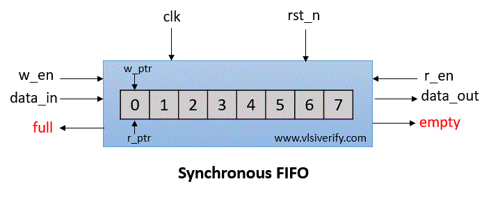

# Parameterized Synchronous FIFO Design and Verification

## Overview

This project implements a **synchronous, parameterized N-bit FIFO** along with a complete **design and verification flow**. 

A FIFO First In First Out buffer is widely used to handle temporary data storage and flow control between producer and consumer blocks operating in the same clock domain.

---

## What is a FIFO

A FIFO is a memory structure where data is read in the same order in which it was written.

Basic operations:
- Write operation pushes data into the FIFO
- Read operation pops the oldest data from the FIFO

Key characteristics:
- Preserves data ordering
- Decouples data producer and consumer
- Prevents data loss during rate mismatch

---

## FIFO Width

**FIFO width** refers to the number of bits stored per entry in the FIFO.

Examples:
- 8-bit FIFO for control data
- 32-bit FIFO for data paths
- 64-bit FIFO for high throughput designs

Why FIFO width matters:
- Determines the size of each data word
- Impacts memory utilization
- Must match the interface width of connected blocks

In this project, FIFO width is parameterized using a `DATA_WIDTH` parameter, allowing the same FIFO to support different data sizes without code changes.

---

## FIFO Depth

**FIFO depth** refers to the total number of data entries the FIFO can store.

Examples:
- Depth 4 or 8 for small buffers
- Depth 16, 32, or more for burst handling

Why FIFO depth matters:
- Controls how much data can be buffered
- Helps absorb bursty traffic
- Prevents overflow and underflow

Depth directly affects:
- Address width of memory
- Pointer size
- Latency and area

In a parameterized FIFO, depth is configurable using a `DEPTH` parameter. Address width is typically derived as:

[Synchronous FIFO - VLSI Verify](https://vlsiverify.com/verilog/verilog-codes/synchronous-fifo/)

## FIFO Interview Questions and Answers

### What is the difference between FIFO width and FIFO depth?
**Width** defines how many bits are stored per entry, while **depth** defines how many entries the FIFO can store.

---

### How do you calculate address width for a FIFO?
Address width is calculated using the logarithm base 2 of the depth.

---

### How is FIFO full condition detected?
FIFO is full when the next write pointer equals the read pointer with the MSB inverted. This extra bit helps distinguish between full and empty states.

---

### How is FIFO empty condition detected?
FIFO is empty when the read pointer equals the write pointer.

---

### Why is an extra bit used in FIFO pointers?
The extra bit helps differentiate between full and empty conditions when read and write pointers are equal.

---

### What happens when read and write happen at the same time?
If FIFO is neither full nor empty:
- Data is written and read in the same clock cycle
- Pointers for both operations are updated

---

### What happens if write is asserted when FIFO is full?
The write operation is ignored to prevent data overwrite.

---

### What happens if read is asserted when FIFO is empty?
The read operation is ignored to prevent invalid data output.

---

### Why is FIFO parameterization important?
Parameterization allows the same FIFO design to support different widths and depths without modifying the core logic.

---

### How do you verify FIFO ordering?
A scoreboard is used to compare written data with read data to ensure correct ordering.

---

### What is pointer wrap around in FIFO?
When a pointer reaches the maximum address, it wraps back to zero using modulo arithmetic.

---

### What is the difference between synchronous and asynchronous FIFO?
Synchronous FIFO uses a single clock, while asynchronous FIFO uses separate clocks for read and write and requires synchronization logic.

---

### What assertions are commonly used in FIFO verification?
- No write when FIFO is full
- No read when FIFO is empty
- Correct full and empty flag behavior
- Data integrity checks

---

### Why is functional coverage important for FIFO verification?
It ensures that all critical scenarios such as full, empty, and wrap around cases have been exercised.

---

